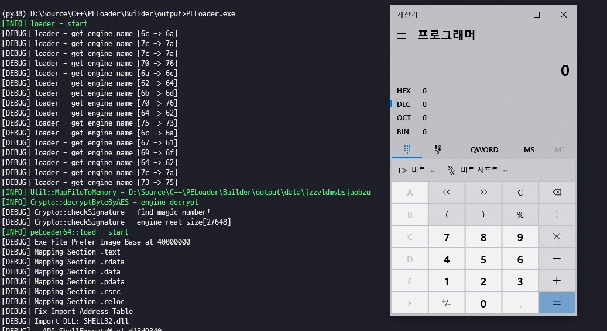

Encrypted-PE-Loader
=================

Original code base by aaaddress1 (https://github.com/aaaddress1/RunPE-In-Memory)

Run 32/64 bit exe binary file in memory (Crypto++ not included)

This project is added below feature:

* PE Encryption (Protector)
* Exe name mangling
* Encrypted PE loading

